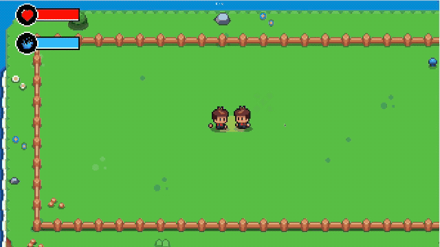

# JJK — Cursed Energy Fighting Game

A 2D top-down 1v1 fighting game built in Unity, with an original **cursed-energy resource system** and **online netplay** over Photon Fusion 2. All characters, names, and art are original — no copyrighted content.

> **Status:** Playable prototype. The full combat loop (movement, attacks, dodges, an overdrive stance, and a strategic "domain expansion" resource-warfare mechanic) works locally and online in a best-of-5 match. It is a gameplay-engineering prototype, not a shipped game — see [Limitations](#limitations).

**Engine:** Unity 2022.3.62f2 (LTS) · **Language:** C# (~4,700 LOC across 40 scripts) · **Netcode:** Photon Fusion 2 (Shared Mode)

---

## Demo



*Local 2-player match: 8-direction movement, an aimed auto attack connecting, hitstun and screen-flash feedback on the victim, the opponent's floating health bar, and the local player's HP (red) / cursed energy (blue) draining in the corner HUD.*

---

## Why this project is interesting (for reviewers)

Most student game projects are single-player and stop at "the character moves and can take damage." This one is built around three engineering problems that are genuinely hard:

1. **A resource economy, not just a health bar.** Every action spends a shared *cursed energy* pool that regenerates over time. Dodging, the special attack, the overdrive stance, and the domain mechanic all draw from the same pool, so play is about resource management, not just reflexes.
2. **Deterministic, frame-authored combat.** Attack phases (startup → active → recovery) are authored in *animation frames* and auto-scale to each clip's length, so timing stays locked to the art regardless of clip duration or playback speed. Combos, hitstun decay, and wall-splats are all derived from this timing model.
3. **Networked fighting-game feel.** Online play runs on Photon Fusion in Shared Mode with client-authoritative movement and **server-validated damage** (clients never get to assert "I hit you"). Proxy smoothing and hit-timing were tuned by hand to keep the game responsive across the network.

The whole thing is deliberately **component-based**: base player behaviour is shared, and new characters are defined by *configuration and composition*, not by subclassing or copy-pasted logic.

---

## Core mechanics

| System | What it does |
|---|---|
| **Movement** | 8-direction top-down movement on a `Rigidbody2D`, with Y-sorting so the lower player draws in front. |
| **Cursed Energy** | A single regenerating resource pool that gates every ability. Run dry and you can't dodge, special, or overdrive. |
| **Auto attack** | Frame-authored melee swing (startup/active/endlag/cooldown). Optional throwable or projectile mode. |
| **Aimable attack** | Hold-to-aim / release-to-fire "jump" special with i-frames on the leap. Costs energy; refuses to fire if you're short. |
| **Roll** | Universal dodge — dash + invincibility frames, at an energy cost. |
| **Overdrive** | Toggled stance that spends energy (then health) for more speed and heavier attacks; tints the character red and strobes the local player's screen. |
| **Domain Expansion** | A strategic **resource-warfare** state machine (see below) — deliberately *not* a guaranteed-hit super. |
| **Combo & hitstun** | True-combo tracking with knockback that grows per hit, plus a **wall-splat** reaction when a hard hit pins you against a wall. |
| **Training dummy** | A non-fighting practice target that never dies, auto-resets, and shows a live damage/combo readout. |

### Domain Expansion — the signature system

Instead of a cinematic "I win" button, a domain is an economic gamble:

- Costs a chunk of energy up front, then **drains energy every second** it stays open.
- While your domain is up you get a **free overdrive** and a movement bonus — but your energy is bleeding.
- It **freezes energy regeneration for both players** and locks the opponent out of *their* overdrive.
- If both players open a domain at once, it becomes a **clash**: drain doubles for both, and whoever runs out of energy first collapses — followed by a punishing burnout window where they can't act on their techniques.

It's a state machine that has to stay consistent across two networked clients, which is where most of the netcode complexity lives.

---

## Architecture

The guiding rule: **base components are shared; characters differ only by configuration.** Character-specific logic never leaks into core movement or health.

Every player is a stack of single-responsibility components:

```
PlayerInputHandler         reads Unity input → a network-safe PlayerInputData struct
PlayerMovement             applies movement, drives the animator, handles wall knockback
PlayerHealth               HP, damage, death, invincibility
CursedEnergy               the shared resource pool (regen / spend / drain)
PlayerAnimationController   the ONLY thing that talks to the Animator (by state name)
PlayerCombatController      routes input → auto attack / aimable / domain
PlayerRoll                 dash + i-frames dodge
PlayerOverdrive            the toggled power stance
AutoAttackController       frame-authored melee (+ overdrive heavy variant)
AimableAttackController    frame-authored ranged/jump special
BaseDomainExpansion        the domain state machine (energy, drain, clash, burnout)
```

A new character is created by **duplicating a prefab and tuning serialized fields** — attack frame counts, animation names, hitbox references, energy costs, stats — plus optionally a `BaseDomainExpansion` subclass for a unique bonus. There is no character `if/switch` anywhere in the core.

### Key design decisions

- **Input as a struct.** All gameplay reads a `PlayerInputData` struct, so the network layer can transparently swap local input for received input without touching gameplay code.
- **Network abstraction (`INetworkAdapter`).** Gameplay never calls Fusion directly. `LocalNetworkAdapter` covers offline play; the `Fusion*` components cover online. The same combat code runs in both modes.
- **Animator by state name, never by parameters.** `PlayerAnimationController` is the single choke point for animation, calling `Animator.Play(state)` directly. Combat and movement scripts are forbidden from touching the Animator.
- **8-direction art from 4 clips.** Directions fold via `SpriteRenderer.flipX` (west mirrors east, etc.), so a full 8-way character needs only four directional clips per action.
- **Frame-based attack timing.** Attack phases are authored as integer frame counts that renormalize to fill whatever clip is playing, so timing tracks the art automatically and stays in lockstep across the network.

### Folder structure

```
Assets/
  Scripts/
    Player/    Movement, health, energy, input, animation, combat, attacks, roll, overdrive, dummy
    Domain/    BaseDomainExpansion state machine + StandardDomainExpansion subclass
    Combat/    Hitbox, Hurtbox, AttackHitboxController, Projectile
    Network/   INetworkAdapter, LocalNetworkAdapter, and the Fusion Shared-Mode sync layer
    Match/     MatchManager (offline), camera follow/shake, screen effects
    UI/        World/corner HP + energy bars, combo counter, match/round screens, blackout
  Scenes/
    Arena.unity   the playable scene
docs/        README media (demo GIF)
CLAUDE.md    detailed engineering spec / working agreement for the codebase
DEV_NOTES.md scene-setup and prefab-wiring notes
```

---

## Tech stack

- **Unity 2022.3.62f2 (LTS)** — 2D, built-in render pipeline, top-down perspective
- **C#** — event-driven (`Action<>`) cross-component communication, one class per file
- **Photon Fusion 2** — Shared Mode online netplay, client-authoritative movement, authority-validated damage
- **TextMeshPro** — UI text
- **Unity 2D toolset** — Tilemap (+ extras), Sprite, Aseprite importer, Pixel Perfect
- **ParrelSync** — spins up a second local Unity instance to test netplay without a second machine

---

## Running it locally

**Prerequisites:** Unity **2022.3.62f2** (via Unity Hub) on Windows or macOS.

1. Clone the repo and open the project folder in Unity Hub (it will resolve packages on first open).
2. Open `Assets/Scenes/Arena.unity`.
3. Press **Play**.

For **online play** you need a free Photon Fusion App ID:

1. Create an app at [photonengine.com](https://www.photonengine.com/) and copy the **Fusion** App ID.
2. Paste it into the Photon App Settings asset (via the Fusion Hub in Unity, or the asset inspector).
3. To test both sides on one machine, use **ParrelSync** (`ParrelSync → Clones Manager`) to launch a second instance, then have one client host and the other join.

> Photon credentials are **not** committed. Without an App ID, online mode won't connect; the local systems still run.

### Controls

| Action | Player 1 | Player 2 |
|---|---|---|
| Move | `WASD` | Arrow keys |
| Auto attack | Left Click | Numpad 1 |
| Aimable special (hold → release) | `Q` | Numpad 2 |
| Roll / dodge | Right Click | Numpad 0 |
| Overdrive (toggle) | Left `Shift` | Right `Shift` |
| Domain Expansion | `E` | Numpad 3 |

---

## What I built

Everything in `Assets/Scripts/` is original work: the full component-based player stack, the cursed-energy resource economy, the frame-authored combat/hitstun/combo/wall-splat systems, the overdrive stance, the domain-expansion state machine, and the Photon Fusion Shared-Mode sync layer (movement, combat, round/match flow) behind an `INetworkAdapter` abstraction. Art and animations are placeholder/original assets wired into the animation system.

---

## What I learned

- **Designing for a network from day one is cheaper than retrofitting it.** Putting input behind a struct and networking behind `INetworkAdapter` from the start meant online play was an *addition*, not a rewrite.
- **Fighting-game "feel" is mostly timing, and timing must be authored, not hardcoded.** Deriving attack windows from animation frames — rather than magic-number seconds — kept the game tunable and consistent as the art changed.
- **Client-authoritative movement + server-validated damage** is a practical trust model for a 1v1: responsive locally, but a client can never fabricate a hit.
- **Proxy smoothing is a real tradeoff.** Several "obvious" fixes (raising send rate, sprite-only interpolation) made things *worse*; the working solution smooths the whole proxy root in `LateUpdate` and adds no network traffic.

---

## Limitations

Being honest about scope — this is a prototype:

- **Scene/prefab wiring is partly manual.** Player prefabs are assembled from documented component stacks (see `DEV_NOTES.md`); there's no one-click bootstrap.
- **Online is 1v1 best-of-5 only.** No matchmaking lobby beyond host/join, no reconnection, no spectators.
- **Projectiles aren't network-replicated yet.** Damage still resolves correctly on the authority, but a remote proxy won't render the projectile.
- **No rollback netcode.** Fusion Shared Mode with interpolation/authority handling — rollback is explicitly out of scope.
- **Audio is stubbed.** Event hook points exist; sound isn't wired throughout.
- **Art is placeholder.** The animation and VFX systems are real; the sprites are stand-ins.

---

## Future improvements

- Network-replicate projectiles through Fusion `Runner.Spawn`.
- A second fully-authored character to prove the "configuration-only" character pipeline end-to-end.
- Matchmaking lobby + reconnection handling.
- Audio pass across the existing event hooks.
- A simple training-mode UI for frame data / hitbox visualization.

---

## Repository docs

- **`CLAUDE.md`** — the detailed engineering spec: component contracts, animation-state naming, attack-phase timing model, and the domain-expansion state machine. Start here to understand *how* the systems fit together.
- **`DEV_NOTES.md`** — scene setup and prefab-wiring reference.
